# 第一周项目报告

## 项目概述

本项目旨在使用 Rust 编写一个基础的光线追踪渲染器（Ray Tracer）。项目参考了《Ray Tracing in One Weekend》系列的基本结构，逐步构建从向量数学、光线投射到多种材质处理与图像输出的完整渲染流程。

第一周的目标是完成基础框架搭建与单线程渲染的基本功能实现，包括：

- 向量运算模块（`vec3.rs`）
- 光线结构定义（`ray.rs`）
- 球体与场景的碰撞检测（`hittable.rs`）
- 基础漫反射材质
- 相机模型（`camera.rs`）
- 彩色图像输出（PPM格式）

## 项目结构

本项目为标准 Rust 项目结构，主要源码分布如下：

```
src/
├── main.rs // 程序入口，场景搭建与渲染控制
├── vec3.rs // 三维向量 Vec3（用于位置、方向、颜色）
├── ray.rs // 光线 Ray 定义
├── hittable.rs // 可碰撞对象 trait 与 Sphere 实现，与hittable_list用于构建多个物体组成的场景
├── camera.rs // 相机模型与像素坐标系计算
├── material.rs // 材质 trait 与漫反射材质实现
├──intervals.rs //  
└── rtweekend.rs // 随机数、辅助函数等
```

## 构建过程

1. **颜色渐变基础图像生成**  
   在开始这个项目的时候，我先了解了 Rust 的基本语法，并按照教材指引完成了一个横向颜色渐变图像的输出。在这一阶段，我初步理解了图像分辨率的控制、`for` 循环如何遍历像素，以及 `camera` 的概念对图像生成的影响。之后，我实现了一个带有天蓝色渐变背景的图像，模拟天空的颜色变化：

   

2. **引入球体对象与碰撞检测**  
   接下来，我在代码中加入了球体的数学定义，并实现了 `Hit` trait 来判断光线与球体的交点。通过球体表面法向量的计算，我能够根据交点的法线方向给球体着色，生成了更有立体感的球体图像：

   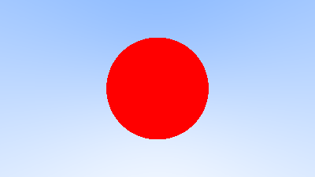

3. **颜色响应与基础着色**  
   我为场景中的物体设置了基础的 Lambertian 材质模型，使得球体在不同角度下显示不同亮度，实现了基本的光照与散射效果。光线会在撞击物体表面后反弹，并递归计算最终颜色，使图像更加真实。此时每个像素开始考虑多次光线路径，提升了渲染质量：

   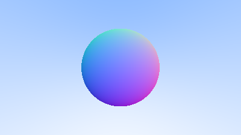

4. **加入地面球体构建场景**  
   为了使场景更有空间感，我加入了一个大球体作为地面。此时场景中包含一个悬浮的小球与一个地面大球。通过调整球心位置与半径，我使它们形成类似现实中的“地面+物体”的关系：

   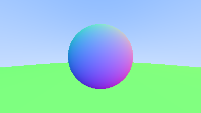

5. **抗锯齿处理与图像增强**  
   在初步渲染输出中，我注意到图像边缘存在严重锯齿，且图像整体较暗、不自然。分析后发现，每个像素只采样一次，导致 aliasing 现象明显。为此我实现了**多重采样抗锯齿**策略，对每个像素进行多次随机采样，并对颜色进行平均处理。同时，在输出图像时对颜色应用 **Gamma 校正**（，使得图像整体亮度更自然，细节更丰富。渲染效果有了明显提升。

5. **抗锯齿处理与图像增强**  
   在初步渲染输出中，我注意到图像边缘存在严重锯齿，且图像整体较暗、不自然。分析后发现，每个像素只采样一次，导致 aliasing 现象明显。为此我实现了**多重采样抗锯齿**策略，对每个像素进行多次随机采样，并对颜色进行平均处理。同时，在输出图像时对颜色应用 **Gamma 校正**（通常为 γ = 2），使得图像整体亮度更自然，细节更丰富。渲染效果有了明显提升。

   

6. **引入光线反射与能量递减模型**  
   在进一步探索中，我引入了光线的递归反射机制，使得物体不仅可以接收光，还能反射光。这要求在每一次反射中衰减光的强度，通过调节反射比例系数（如 0.5），可以得到不同明暗程度的渲染结果。然而在反射比例较低时，图像仍然显得偏暗：

   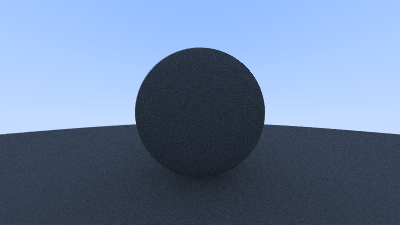
   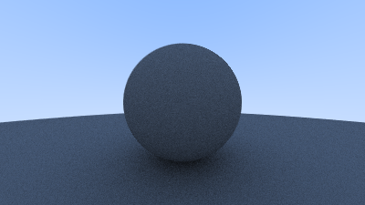

   为此，我引入了新的反射模型和更合理的衰减策略，使得图像看起来更加明亮与自然：

   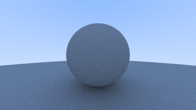
   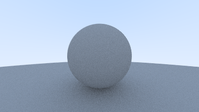

7. **引入玻璃与金属材质，模拟真实反射与折射**  
   为模拟更多物理材质，我实现了金属和玻璃两种新的材质类型，分别用于模拟镜面反射和折射现象。每种材质都实现了 `Material` trait，通过其 `scatter` 方法决定光线的行为。

   - **镜面金属材质（无毛刺）**  
     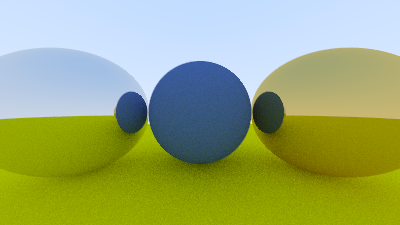

   - **模糊金属材质（含毛刺）**  
     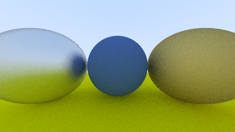

   - **玻璃材质（可折射）**  
     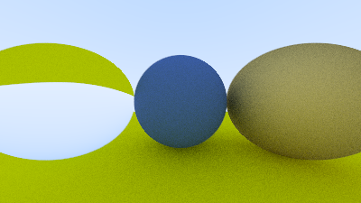

   在进一步测试中，我构建了一个中空玻璃球（内部是负半径球体），模拟真实世界中空心透明物体的光学效果：

   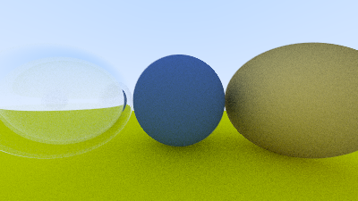

   至此，渲染器已支持三类常见材质：漫反射、金属反射与玻璃折射，为构建更复杂真实的三维场景奠定了基础。

---

8. **构建相机系统与支持视角调节**  
   为提升场景构图与灵活性，我将 `Camera` 封装为一个模块，允许通过构造函数灵活传入参数，如：

   - 摄像机位置（lookfrom）
   - 观察目标（lookat）
   - 视野（vertical FOV）
   - 景深控制（焦距与光圈）

   调整后可获得不同视角下的渲染效果：

   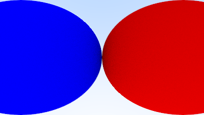

   结合前述三种材质，我构建了一个包含漫反射、金属、玻璃材质的经典“材质测试场景”：

   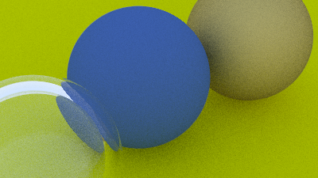

---

9. **引入景深与随机生成球体场景**  
   为模拟真实摄影效果，我引入了**聚焦模糊**（depth of field），通过控制摄像机的光圈与对焦距离来影响图像的景深表现。

   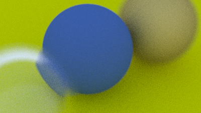

   最后，我使用随机数生成算法，在一个平面上生成了大量球体，并为每个球体随机指定材质（漫反射、金属或玻璃），构建出了一个丰富的、具有随机性和真实感的多物体世界：

   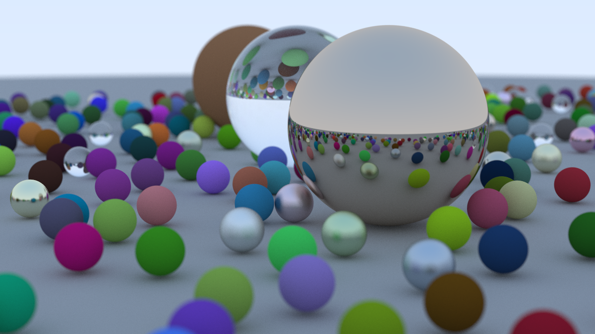

---

>  至此，光线追踪器已经支持基本形状、三种材质类型、抗锯齿渲染、景深模拟与复杂场景生成。后续可考虑进一步优化性能（多线程、BVH 加速结构）或扩展功能（纹理贴图、运动模糊、光源等）。


## 问题与解决

### 1. 折射计算错误导致玻璃材质异常

在实现玻璃材质时，我使用了斯涅尔定律（Snell's Law）进行折射方向的计算。然而由于错误地处理了 `sin` 和夹角关系，导致部分折射光线方向不正确，渲染出的图像在玻璃球处出现了明显失真和非物理现象。尤其在多个玻璃球叠加的场景中，这一问题更加明显：

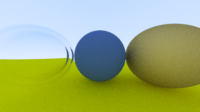

**解决方案：**
- 修正 `Vec3::sin_theta()` 的实现；(cos没有平方)

修正后玻璃效果更加真实，支持中空球体与折射光线的连续传递。

---

### 2. 渲染速度过慢，初步优化运行效率

在生成大型随机场景（如 `image18.ppm`）时，我注意到程序运行时间极长——在 Debug 模式下耗时近 **1.5 小时**，严重影响开发与测试效率。

**优化措施：**

- **启用 Release 模式：**  
  将运行命令从 `cargo run` 改为 `cargo run --release`，启用编译器优化，渲染时间下降至 **30 分钟左右**。

- **初步引入多线程并行渲染：**  
  采用 `crossbeam::thread::scope` 和 `Arc` 共享数据结构，将图像分块分配至多个线程。最终将渲染时间压缩至约 **8 分钟**，加速效果显著。

```rust
crossbeam::thread::scope(|s| {
    for block in blocks {
        s.spawn(|_| render_block(block));
    }
});
```

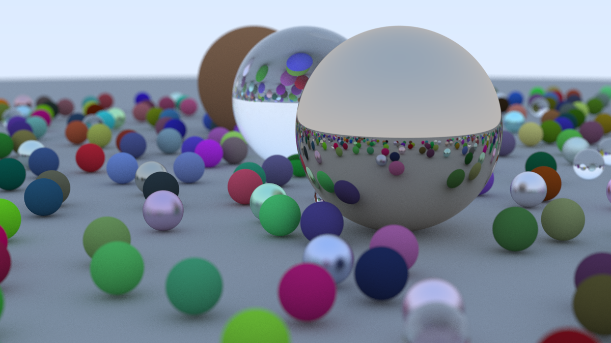