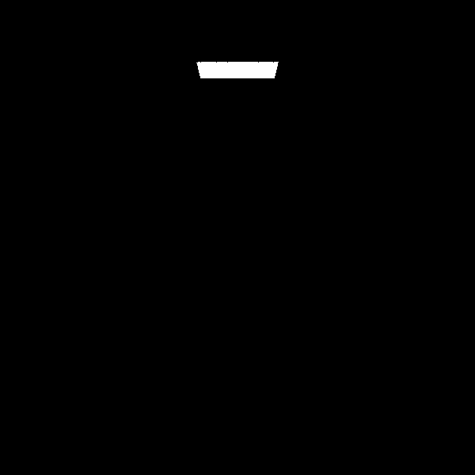

# 光线追踪项目 —— 第二周报告

## 一、工作概述

本周我继续对光线追踪渲染器进行结构优化与性能提升，完成了多线程并行、运动模糊模拟、BVH 加速结构、纹理系统等多个模块的集成与调试。此外，还初步应用了蒙特卡洛采样策略，在保持速度的前提下探索图像质量的变化。顺利阅读并完成了《Ray Tracing: The Next Week》和《Ray Tracing: The Rest of Your Life》两本进阶书籍中的所有实现。

---

## 二、具体进展

### 1. 多线程优化

通过线程并行渲染，每个线程负责图像中的一个子区域，首次优化从原先的 **8 分钟缩短至 5 分钟**。过程中发现任务分配粒度过大会引发内存溢出问题，随后调整分块策略稳定性能。

### 2. 实现运动模糊

为提升真实感，实现了运动模糊效果：

- 每条光线带有时间信息；
- 可移动物体根据时间变化计算其位置；
- 通过多次采样平均结果获得模糊视觉；
- 修改相机的发射逻辑，使其发出的光线包含时间参数；
- 重构 Sphere 类，形成新模块以支持动态物体建模。

### 3. 包围盒层次结构 BVH

引入 BVH（Bounding Volume Hierarchy）以加速命中检测：

- 初始版本略有变慢（2.1s → 2.29s），但扩大图像像素后，优化前 82.4s → 优化后 79.9s，说明 BVH 的性能优势在更复杂场景中体现更明显；
- 后续进一步配合多线程使用 BVH，效果提升显著，最终渲染时间优化为 8.9s。

### 4. 引入纹理系统

- 设计 Texture 抽象类；
- 实现棋盘纹理，通过坐标奇偶性生成黑白格纹理；
- 纹理模块的加入显著提高了图像的细节感和真实感。

### 5. 修复 Bug 与结构调整

- 与学长讨论后修复多个纹理坐标错误与线程资源竞争问题；
- 重构模块代码结构（如 'sphere.rs'、'camera.rs'、'bvh.rs'）提升可读性与可维护性。

### 6. 高级优化：提前终止与重要性采样

- 提前终止（Russian Roulette）显著降低无效递归路径：
  - 时间从 8.9s → 3.76s；
- 初步应用蒙特卡洛随机采样：
  - 图像生成速度基本不变（约 3.57s），但画质下降明显；
  - 后续将进一步调研平衡画质与性能的更优采样策略。

---

## 三、数据对比

| 优化阶段              | 渲染时间（秒）     |
|-----------------------|--------------------|
| 初始实现              | 93.27              |
| 多线程                | 9.84               |
| BVH 多线程优化        | 8.90               |
| 提前终止（RR）        | 3.76               |
| 蒙特卡洛采样（M-C）   | 3.57（画质下降）   |

效果图在image_build_first\converted_pngs里面

---

## 四、现存的问题

在第三本书里面，lights加入球聚光反而除了光源全为黑，但是其他图都符合预期

## 五、心得与反思

- 本周收获颇丰，对光线追踪背后的“物理模拟”思想有了更深理解；
- 性能优化不仅是算法问题，更涉及系统资源调度和结构设计；
- 多线程与递归的协作极具挑战，但调试成功后成就感满满；
- 图像质量与渲染速度是此类项目中永恒的权衡，下一步会探索更高效的采样与抗锯齿策略。

---

## 六、下周计划

- 加入 .obj 模型解析支持，支持外部模型加载；
- 尝试构建基于 GUI 的预览器（可选项）；
- 编写基础渲染脚本，自动生成不同参数下的对比图。
